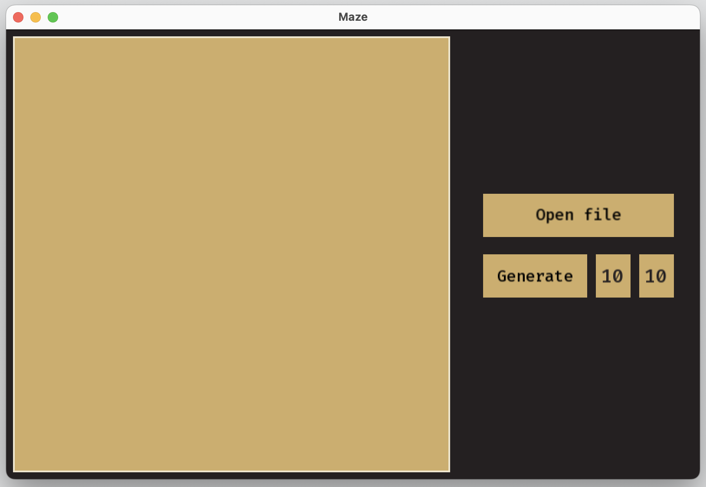
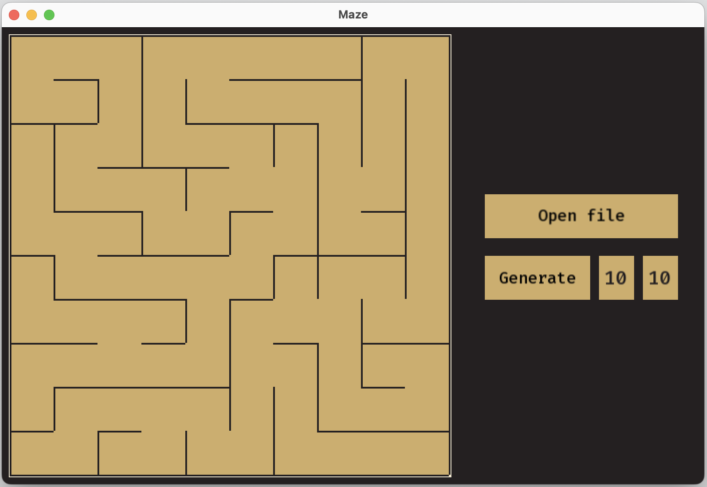
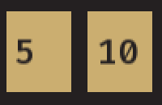
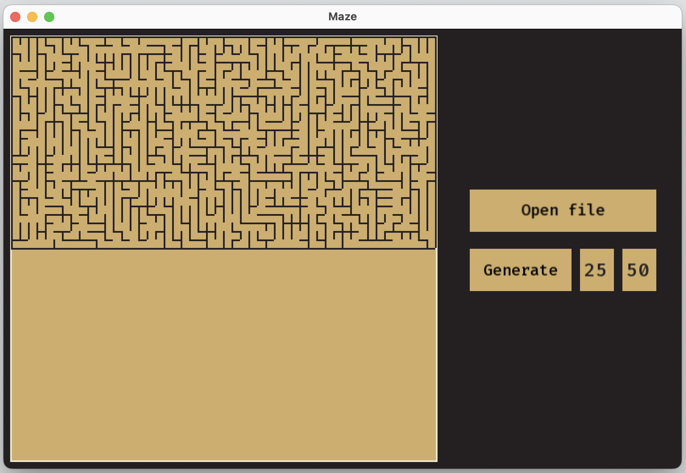
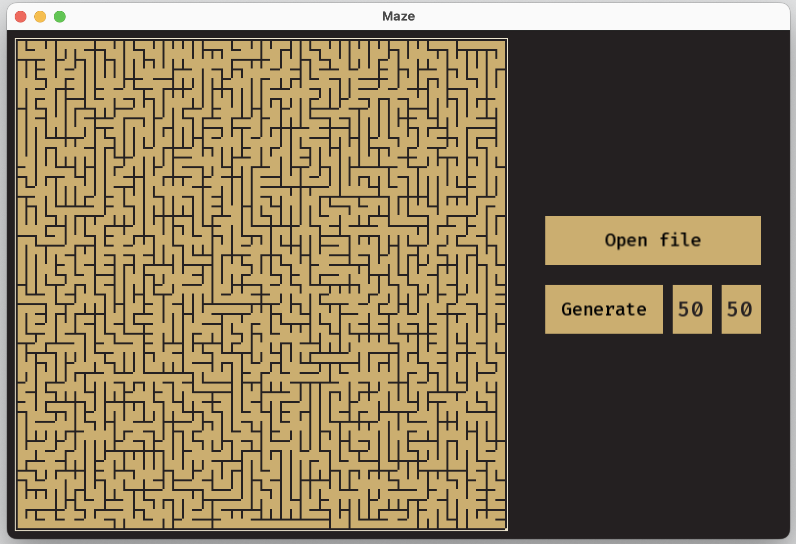
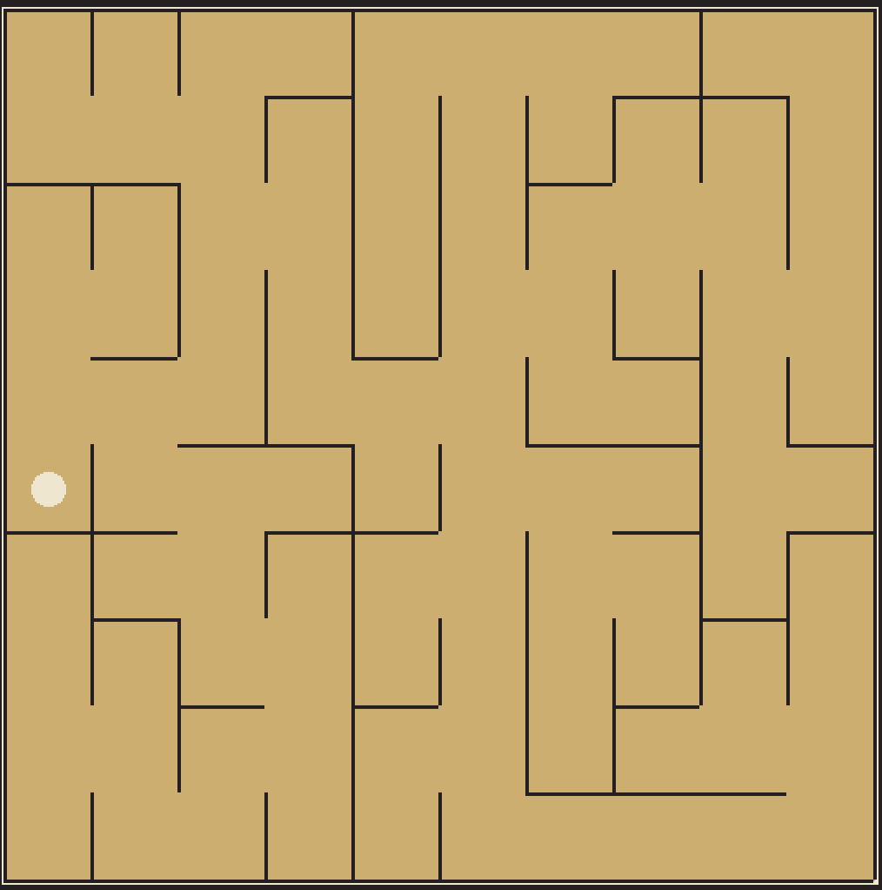
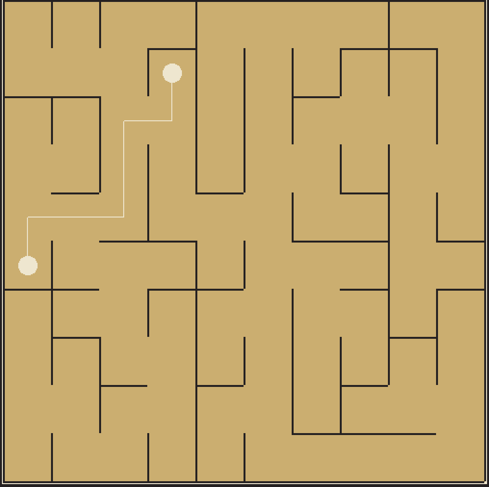
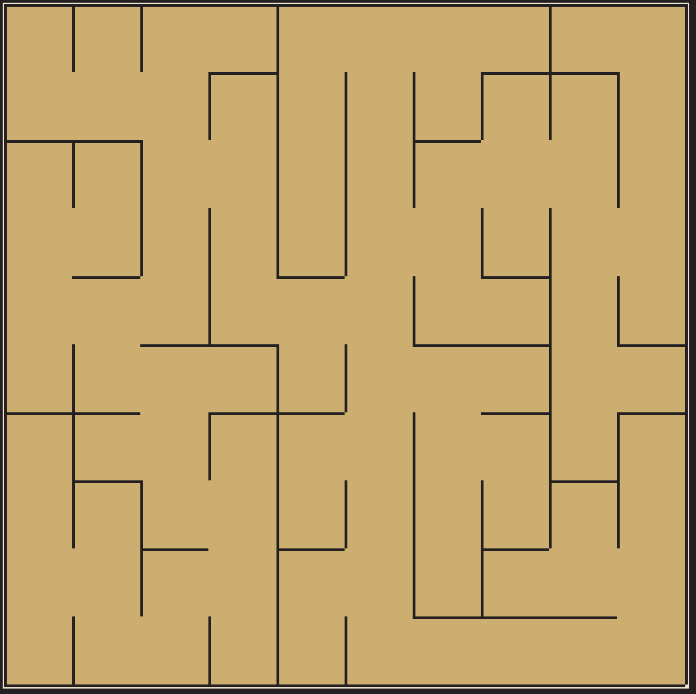

## Maze
School 21 programming school educational project. 

Maze program is designed to read and display mazes from a file, as well as generate unique mazes of a given size. There is also a function for solving mazes from user-specified points. 

{ width=800px }

You can open the maze file by clicking the "Open file" button. 

{ width=800px }

To generate a maze, set the size in the range from 1 to 50 for the number of rows (cell on the left) and columns (cell on the right). 

{ width=100px }

Next, click on the "Generate" button. 

{ width=800px }

{ width=800px }

To launch the maze solving function, click on any point in the displayed maze. The first press sets the starting point. 

{ width=400px }

Next, click again on any point of the displayed labyrinth. The second press sets the end point. 
After this, a path to solve the maze between user-specified points will be constructed. 

{ width=400px }

To reset the maze solution, click on the displayed maze again. 

{ width=400px }

## Installation
To install, you will need cmake, make, and a GCC compiler. 
Navigate to the `src` directory and run the `make install` command.

## For developers
The project is developed following on the SFML cross-platform gui library, in C++17 language . 
All code related to the Model block is documented. To view the doxygen documentation, navigate to the `src` directory and run the `make dvi` command. 
All code related to the Model block is covered on 100% with unit tests. Run command `make gcov_report` from `src`
directory, to view the coverage report. 
